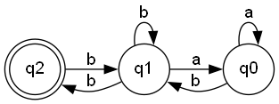

# Determinism in Finite Automata. Conversion from NFA to DFA. Chomsky Hierarchy.

## Course: Formal Languages & Finite Automata

## Author: Konjevic Alexandra FAF-213

## Variant: 22

<br>

## Introduction

Finite automata, also known as finite state machines, are fundamental models in computer science and are used to describe the behavior of systems with a finite number of states. They have been extensively studied and are widely used in various areas of computer science, including language theory, compiler design, hardware design, and artificial intelligence. There are two types of finite automata: deterministic finite automata (DFA) and non-deterministic finite automata (NFA).
A DFA is a finite automaton that recognizes a regular language, where the transitions between states are determined by a fixed set of rules. On the other hand, an NFA is a finite automaton that allows for more than one transition for a given input symbol, which means that it can recognize a broader class of languages. While NFAs are more expressive than DFAs, they are also more complex to design and implement.

<br>

## Objectives

- Understand what an automaton is and what it can be used for.
- Provide a function in your grammar type/class that could classify the grammar based on Chomsky hierarchy.
- Implement conversion of a finite automaton to a regular grammar.
- Determine whether your FA is deterministic or non-deterministic.
- Implement some functionality that would convert an NFA to a DFA.
- Represent the finite automaton graphically (optional):
  - You can use external libraries, tools or APIs to generate the figures/diagrams.
  - Your program needs to gather and send the data about the automaton and the lib/tool/API return the visual representation.

<br>

## Implementation Description

#### `GetChomskyType` method

First of all, in the class `Grammar` I have implemented the method `GetChomskyType` that classifies the grammar based on the Chomsky Hierarchy. The program checks if there is a single symbol on the left side of the production and if this symbol is non-terminal. If the conditions are met for every production, then the conditional statement:

```
foreach (Production production in Rules)
{
    if (production.LeftSide.Length > 1 || !(NonTerminalSymbols.Contains(production.LeftSide[0])))
    {
        hasUnitLeftSide = false;
    }
}
```

is not executed and `hasUnitLeftSide` is `true`, which means that the grammar is of type 3 or of type 2. Next, there is checked one more time each production in the rules, and there is counted how many non-terminal symbols are on the right side of the production, and if there is only one symbol and also, if the symbol is the first or the last in the symbols list, this means that the grammar is the type 3:

```
// type 3 only if there is one non terminal symbol in the right side
    if (i == 1)
    {
        // type 3 only if the non terminal symbol is the first or the last symbol in the right side
        if (!(NonTerminalSymbols.Contains(production.RightSide[0])) && !(NonTerminalSymbols.Contains(production.RightSide[production.RightSide.Length - 1])))
        {
            type3 = false;
        }
    }
```

If the `type3` variable `false`, then the `type2` variable becomes `true`.
If there are more than one symbol on the left side of the production and all of this symbols are non-terminal, then the grammar is of type 1, else, it is of type 0:

```
foreach (Production production in Rules)
{
    // type 1 only if the right side has only terminal symbols
    foreach (string symbol in production.LeftSide)
    {
        if (!(NonTerminalSymbols.Contains(symbol)))
        {
            type1 = false;
        }
    }
}
```

#### `ToGrammar` method

To convert a finite automaton into a grammar, I assigned the states of the FA to the variable `nonTerminalSymbols`, the alphabet of FA to `nonTerminalSymbols`, starting state to the `startingSymbol` and I used the method `TransitionToProduction` to convert transitions to productions - the property `CurrentState` of the `Transition` object was assigned to property `LeftSide` of the object `Production`; similar, the `Symbol` and `NextState` were assigned to `RightSide` (it is an array of strings).

```
public Production TransitionToProduction(Transition transition)
{
    return new Production(new[] { transition.CurrentState }, new[] { transition.Symbol, transition.NextState });
}
```

Overall, the `ToGrammar` method looks like this:

```
public Grammar ToGrammar()
{
    var nonTerminalSymbols = States;
    var terminalSymbols = Alphabet;
    var startingSymbol = StartState;
    var productions = new List<Production>();
    foreach (var transition in Transitions)
    {
        productions.Add(TransitionToProduction(transition));
    }
    return new Grammar(nonTerminalSymbols, terminalSymbols, startingSymbol, productions);
}
```

#### `isDeterministic` method

This is a boolean method which returns true if the FA is deterministic and false if it's non-deterministic. It returns true only if the following condition is met: if there are zero transitions which have the same current state and input symbol and different following state.

```
public bool isDeterministic()
{
    return Transitions.All(
        transition => Transitions.Count(
            transition2 => transition.CurrentState == transition2.CurrentState && transition.Symbol == transition2.Symbol && transition.NextState != transition2.NextState
        ) == 0
    );
}
```

#### `ToDFA` method

This method, first of all, verifies if the FA is already a DFA, and if yes, it returns this FA. Otherwise, the method starts by creating the initial DFA state, which is a set of NFA states containing only the start state of the original automaton.

```
// create initial DFA state
var initialDFAState = new HashSet<string>(new[] { StartState });
var dfaStates = new List<HashSet<string>> { initialDFAState };
var dfaTransitions = new List<Transition>();
```

For each DFA state, the method creates a transition for each symbol in the alphabet of the original automaton. It does so by first finding the set of NFA states that the DFA state represents for each symbol. This is done by iterating through each state in the current DFA state and finding all transitions in the original automaton that match the current state and symbol. The method then takes the set union of all resulting next states to obtain the set of NFA states for the current symbol.

```
foreach (var symbol in Alphabet)
{
    // find the set of NFA states that the DFA state represents
    var nfaStates = new HashSet<string>();
    foreach (var state in dfaState)
    {
        nfaStates.UnionWith(
            Transitions
                .Where(t => t.CurrentState == state && t.Symbol == symbol)
                .Select(t => t.NextState)
        );
    }
    // another code
    }
```

If the set of NFA states for the current symbol is empty, the method skips the symbol and proceeds to the next one.

```
if (nfaStates.Count == 0)
{
    // no transition for this symbol
    continue;
}
```

Otherwise, the method checks if the set of NFA states already corresponds to an existing DFA state. If it does, the method uses the existing DFA state in the transition.

```
if (existingDFAState != null)
{
    // use existing DFA state
    dfaTransitions.Add(new Transition(
        String.Join("", dfaState),
        symbol,
        String.Join("", existingDFAState)
    ));
}
```

Otherwise, the method creates a new DFA state and adds it to the list of states. The method then creates a transition from the current DFA state to the new DFA state for the current symbol.

```
else
{
    // create new DFA state
    var newDFAState = nfaStates;
    dfaStates.Add(newDFAState);
    dfaTransitions.Add(new Transition(
        String.Join("", dfaState),
        symbol,
        String.Join("", newDFAState)
    ));
}
```

Once all transitions for all symbols have been generated for the current DFA state, the method moves on to the next DFA state and repeats the process until no new states are created. Finally, the method returns the resulting DFA.

#### Visualizing the FA

For visualizing the FA I used the package `Graphviz`. In the `FiniteAutomaton` class I created a method `WriteToFile` which export the transitions of finite automaton into a `.dot` file. Next, after compiling the `Program.cs` file, in the terminal I ran the command `dot -Tpng -o fa.png fa.dot` - `fa.png` is the resulting image with the graph and the `fa.dot` file is the one that needs to be compiled.
<br>


<br>

## Results

Given my variant, 22:
In the `Program.cs` file I created a finite automaton. Next, I converted this automaton to a grammar and I verified the conversion by printing all the productions of the obtained grammar:

```
foreach (var production in finiteAutomaton.ToGrammar().Rules)
{
    Console.WriteLine(production.LeftSide[0] + " -> " + production.RightSide[0] + " " + production.RightSide[1]);
}
```

Output:

```
q0 -> a q0
q0 -> b q1
q1 -> b q1
q1 -> b q2
q1 -> a q0
q2 -> b q1
q2 ->  q2
```

Then, I checked the type of the obtained grammar. Output:
`Type 3`

After that, I checked if the FA is deterministic. Output:
`False`

Next, I converted the NFA to DFA and printed all of its transitions:

```
foreach (var transition in dfa.Transitions)
{
    Console.WriteLine(transition.CurrentState + " " + transition.Symbol + " " + transition.NextState);
}
```

Output:

```
q0 a q0
q0 b q1
q1 a q0
q1 b q1q2
q1q2 a q0
q1q2 b q1q2
```

## Conclusion

Overall, this laboratory work presented a comprehensive implementation of various methods in C# programming language. The main focus of this work was on the theory of formal languages and automata. The methods implemented include checking the type of grammar by Chomsky classification, converting a Finite Automaton (FA) to a grammar, determining whether an FA is deterministic or not, and converting a Non-Deterministic Finite Automaton (NFA) to a Deterministic Finite Automaton (DFA).
The implementation of these methods provides a practical understanding of the theoretical concepts of formal languages and automata. The implementation of the Chomsky classification algorithm ensures that the type of grammar can be checked with ease. The implementation of the algorithm for converting FA to a grammar allows for the easy transformation of FAs to their equivalent grammar form. The implementation of the DFA and NFA conversion algorithms also allows for easy transformation of these automata forms, which is essential in automata theory.
Furthermore, the implementation of these methods provides an opportunity for optimization and further development. For example, one can explore ways to optimize the algorithms implemented, such as minimizing the number of states in an NFA or DFA. Additionally, one can extend these methods to implement other algorithms, such as algorithms for constructing an FA from a regular expression, and vice versa.
In conclusion, the implementation of these methods in C# provides a useful tool for practical application of automata theory in solving problems related to formal languages. These methods can be further optimized and extended to include other algorithms, thus improving their usefulness and practicality.
